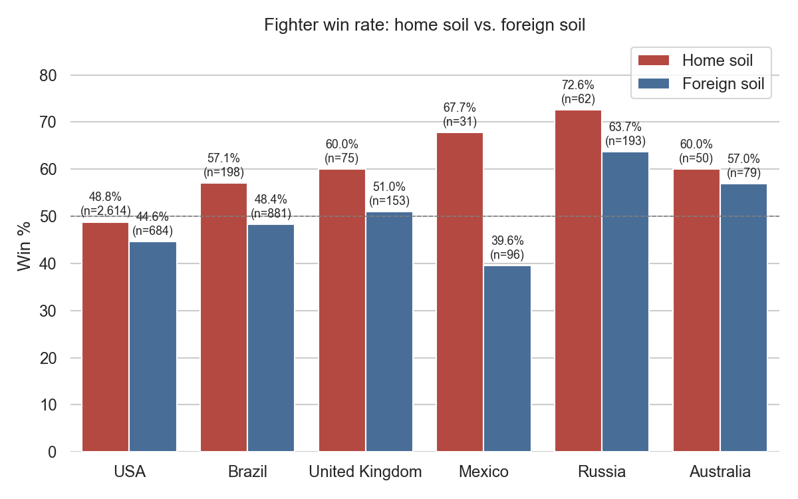
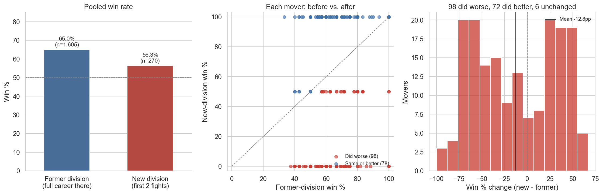

# Analytics

Exploratory, hypothesis-driven stats analysis on top of the prediction pipeline's
data. Unlike `ml/`, nothing here trains or feeds a model -- these are one-off
questions tested against the actual fight history in `raw_data/ufc-master.csv`
(and, for fighter nationality, a purpose-built scrape).

Each script is self-contained and reproducible:

```bash
python analytics/home_advantage.py
python analytics/weight_class_move.py
```

Both regenerate their chart into `analytics/reports/` and print the underlying
numbers (win rates, sample sizes, significance tests) to stdout.

---

## Does fighting at home actually help?

**Script:** `home_advantage.py` | **Chart:** `reports/home_advantage.png`

UFC fans often credit a "home crowd advantage" -- fighters supposedly get the
benefit of the doubt from judges, or perform better in front of a home
crowd. This compares each fighter's win rate on home soil vs. foreign soil,
restricted to fights that went to a **judges' decision** (the outcome type
where a scoring bias could actually operate -- a finish isn't scored by
judges).

Fighter nationality doesn't exist anywhere in this repo's databases, so it's
sourced separately: `scrapers/ufc_fighter_nationality.py` scrapes each
fighter's hometown from their ufc.com athlete page.



6 countries, 5,116 decision fighter-fight records from 1,307 fighters:

| Country | Home win% | Away win% | Diff | p-value |
|---|---|---|---|---|
| Mexico | 67.7% (n=31) | 39.6% (n=96) | **+28.2pp** | 0.006 |
| Brazil | 57.1% (n=198) | 48.4% (n=881) | +8.7pp | 0.027 |
| USA | 48.8% (n=2,614) | 44.6% (n=684) | +4.2pp | 0.049 |
| Russia | 72.6% (n=62) | 63.7% (n=193) | +8.9pp | 0.201 |
| United Kingdom | 60.0% (n=75) | 51.0% (n=153) | +9.0pp | 0.199 |
| Australia | 60.0% (n=50) | 57.0% (n=79) | +3.0pp | 0.733 |

USA, Brazil, and Mexico clear p < 0.05. Mexico's gap is the largest in the
dataset but rests on only 31 home-soil decisions, so treat the size of that
effect cautiously even though it's significant. UK, Russia, and Australia
don't reach significance at this sample size -- read those as suggestive,
not confirmed. No correction is applied for testing 6 countries at once.

Mexico's +28.2pp is also an abrupt outlier relative to the other countries --
roughly 3x the next-largest gap (Russia/UK, both around +9pp). One plausible
explanation beyond sample noise: the UFC has invested heavily and
deliberately in building a Mexican star for years (title fights, historically
massive stadium cards on Cinco de Mayo/Independence Day weekends in Mexico
City, marketing push around fighters like Yair Rodriguez and Brandon
Moreno), which could plausibly translate into unusually partisan crowds and
scoring at those specific events beyond the "home country" effect seen
elsewhere. That's a hypothesis this dataset can't distinguish from ordinary
home-soil advantage or small-sample noise on its own -- just a real
candidate explanation for why Mexico's number sits so far above the rest.

One modeling choice worth knowing about: "home soil" for Russian fighters
also counts the UAE, Qatar, and Saudi Arabia, since Russian (and wider
Caucasus/Dagestani) fighters fight often on that promotional axis. The
implicit claim behind that choice is that a Russian fighter gets the same
kind of favorable treatment -- crowd, judges, whatever's driving the
home-soil effect elsewhere -- when fighting in the Middle East as they would
fighting in Russia itself, since those events draw heavily on the same
fanbase and promotional ties. Russia's result (+8.9pp) doesn't reach
significance at this sample size, so that claim is untested rather than
confirmed, but it's the reasoning behind lumping the four countries
together instead of scoring Russia on Russia-only fights.

---

## Does "lighter man skill" hold up when a fighter moves up in weight?

**Script:** `weight_class_move.py` | **Chart:** `reports/weight_class_move.png`

The claim, as fans usually put it: a fighter who moves up a weight class
performs better there than their record elsewhere would suggest, because
they're bringing skills honed against faster, more technical competition in
the lighter division. This tests it directly -- for every fighter who moved
up in weight, it compares their win rate across their **entire career in the
division they came from** against their win rate in their **first few fights
in the new, heavier division**.

Current settings: fighters need at least **5 fights** in the old division
(so the "before" side isn't a fluke of a couple of bouts), and the "after"
side looks at their **first 2 fights** in the new division. (Both are
constants at the top of the script -- `MIN_OLD_FIGHTS` / `FIRST_N_NEW` --
and were swept across several values while testing this; the conclusion
below held at every setting tried, from requiring 3-7 old-division fights
and looking at 1-3 new-division fights.)



176 weight-class-up moves, from 176 unique fighters:

| | Old division (career there) | New division (first 2 fights) |
|---|---|---|
| Win % | 65.0% (n=1,605) | 56.3% (n=270) |

- **Pooled two-proportion z-test:** -8.7pp, p = 0.006
- **Paired Wilcoxon signed-rank** (each mover vs. their own prior form):
  mean -12.8pp, median -12.5pp, p = 0.0001

Of the 176 movers, **98 did worse** in the new division than their old-division
form, 72 did better, 6 were unchanged.

Both tests -- the pooled comparison and the more appropriate paired one, since
the claim is really about each fighter relative to *their own* baseline --
say the same thing strongly: fighters do noticeably **worse**, not better, right
after moving up. That's the opposite of the "lighter man skill" theory, and
much more consistent with the simpler explanation: they're suddenly fighting
bigger, stronger opponents, and results take a real hit while they adjust.

One caveat: with only 1-2 fights counted per mover on the "new division"
side, each mover's new-division win rate is coarse by construction (0%, 50%,
or 100% at `FIRST_N_NEW=2`). That's inherent to testing *early* performance
specifically, not a bug -- but it's why the paired Wilcoxon test (robust to
that coarseness) is the one to trust over the pooled bar chart alone.
